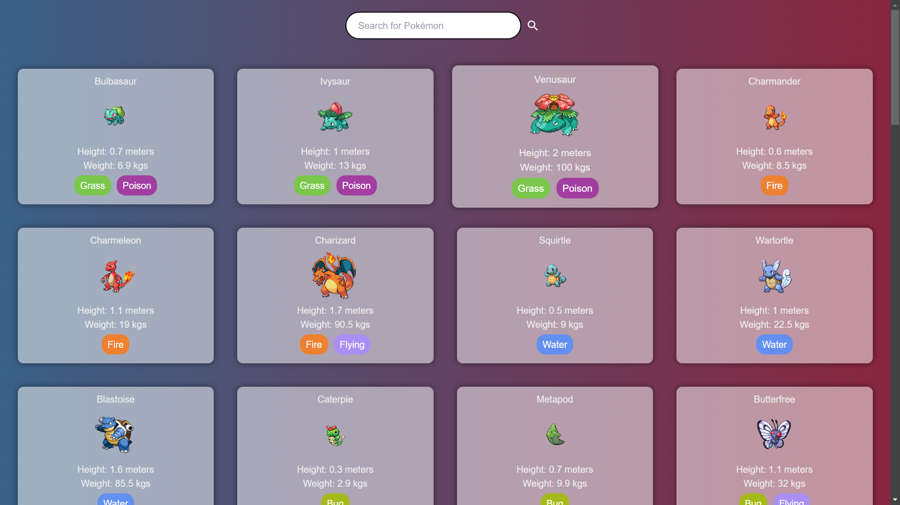

# Code Walnut Frontend Tech Test

### Setup instructions.

1. Clone the repository
2. Run `pnpm install` to install the dependencies
3. Run `pnpm dev` to start the development server

### Explanation of my approach.

#### Infinite Scroll

Rather than going for a pagination approach, I decided to implement an infinite scroll feature. This is because it is a more modern approach which looks really nice when loading data and it provides a better user experience. I used the Intersection Observer API to detect when the user has scrolled to the bottom of the page (last element) and then fetched more data from the API. This approach is more efficient as it only fetches data when the user needs it. I also added a loading spinner to indicate to the user that the initial data is being fetched.

#### Card Based Layout

I decided to use a card based layout for the project as it is a common design pattern for displaying information in a structured way. I used `divs` coupled with simple elements in a flex layout to create a reusable component that can be used to display information in a structured way. I also show the pokemon types in a badge format to make it easier for the user to see the type of pokemon at a glance.

#### Responsive Design

My design is responsive and support mobile as well as desktop view. I used media queries to adjust the layout of the cards based on the screen size. I also used Modular CSS to prevent the styles from leaking into other components. The media queries i used for this can be found in the `styles.module.css` file.

#### Search Functionality

The user can search for pokemons based on their name.

#### Dialog for more information

I implemented a dialog that shows more information about a pokemon when the user clicks on a card. This dialog shows the pokemon's name, image, type. I used the `Dialog` component from Material UI to implement this feature.

#### Tests

I added some tests for my page that check if things like the loading indicator is shown, if the "no pokemons found" message is shown when no pokemons are found, etc.

#### Screenshots

### Any challenges or trade-offs you encountered

#### No search functionality

Since the pokemon api provided does not have the ability to search for pokemons based on their name, I was able to only show search results from the available pokemon. The api also has a rate limit on the number of requests that can be made in a minute, so I was unable to pull the entire database for filtering.

#### Time constraints

Due to the time constraints, i had to prioritize some features over others. I was unable to implement a feature that would allow the user to filter pokemons based on their type. I also was unable to implement a feature that would allow the user to sort the pokemons based on their name or id. I wanted to make small cards for each of the pokemon types and display them above the pokemon list such that a user could click on a type and see only pokemons of that type. I also had to spend considerable time debugging the code as there were bugs and the logic was complex.
